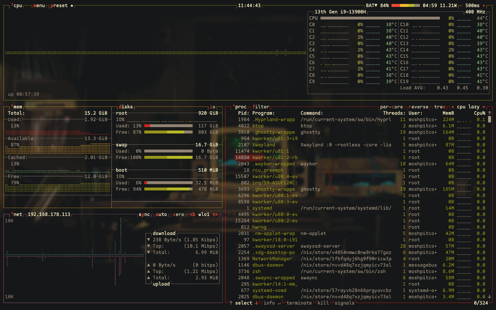

<h1 align="center">
   
   <br>
      My NixOS Configuration
   <br>
       <br>

   <div align="center">
      <p></p>
      <div align="center">
         <a href="https://github.com/MoshPitCodes/moshpitcodes.nix/stargazers">
            
         </a>
         <a href="https://github.com/MoshPitCodes/moshpitcodes.nix/">
            
         </a>
         <a href="https://nixos.org">
            
         </a>
         <a href="https://github.com/MoshPitCodes/moshpitcodes.nix/blob/main/LICENSE">
            
         </a>
      </div>
      <br>
   </div>
   <div>
      <a href="https://github.com/MoshPitCodes/moshpitcodes.nix/actions/workflows/test-flake.yml">
         
      </a>
      <a href="https://github.com/MoshPitCodes/moshpitcodes.nix/actions/workflows/test-configurations.yml">
         
      </a>
   </div>
</h1>
<br/>

# 🗃️ Overview

Hi,

My name is Mosh and this is my personal NixOS system configuration. This is something I have been working on over the past couple of months while learning NixOS and slowly transitioning from Windows to NixOS for all my development work. I am using this as my daily driver on an ASUS Zenbook 14X OLED now with the following hardware:

- Intel Core i9 13900H
- Intel XE Graphics
- 16GB DDR-5 RAM
- 3 external monitors
- USB Hub, docking station and peripherals like webcam, DAC, and more

Additionally, I'm using this on a desktop machine as a dual boot system for when I feel like it:
- Intel Core i7 13700K
- Nvidia RTX 4070Ti Super
- 64GB DDR-5 RAM
- 3 external monitors
- USB Hub, docking station and peripherals like webcam, DAC, and more

> [!WARNING]
> This is a heavily opinionated configuration that is likely not a great repository if you're just starting out with Linux or if you're trying to learn what NixOS is all about. The approach to building a modular, reusable and reproducible environment might not even align with best practices since I am not a NixOS expert by any stretch of the imagination. This is a personal project that is based on my experience in the NixOS ecosystem, information from the community and the wonderful open-source creators in the NixOS space. The setup is tailored to my specific needs and wants and will likely not provide a great baseline for you to build off of. Even though there are things packaged like the Steam client for gaming, this configuration is mainly used by myself as a proving ground and learning opportunity. Do not expect anything else.

And now, let the fun begin!

<br/>

## 📚 Project Structure

-   [./flake.nix](flake.nix) Entry point to the configuration
-   [./hosts/](hosts) 🌳 Per-host configurations that contain machine specific setups
    - [../desktop/](hosts/desktop/) 🖥️ Specific configuration for desktop machines
    - [../laptop/](hosts/laptop/) 💻 Specific configuration for laptops
    - [../vm/](hosts/vm/) 🗄️ QEMU/KVM specific configuration
    - [../vmware-guest/](hosts/vmware-guest/) 🗄️ VMWare Workstation/Player specific configuration
    - [../wsl/](hosts/wsl/) 🪟 WSL2 specific configuration for Windows development
-   [./modules/](modules) 🍱 Modularized NixOS configurations
    -   [../core/](modules/core/) ⚙️ Core NixOS configuration
        - System configuration (bootloader, hardware, networking, security)
        - Services (pipewire, flatpak, virtualization, steam, samba)
        - Platform-specific overrides (VM, WSL)
    -   [../home/](modules/home/) 🏠 [Home Manager](https://github.com/nix-community/home-manager) user configurations
        - Desktop environment (Hyprland, Waybar, Rofi, etc.)
        - Development tools (VSCode, Neovim, Git, etc.)
        - CLI tools and utilities (zsh, tmux, yazi, etc.)
        - Applications (Browser, Discord, Gaming, etc.)
-   [./overlays/](overlays) 🔧 Nixpkgs overlays for package version overrides
-   [./shells/](shells) 🧪 Development shell environments (claude-flow, devshell)
-   [./scripts/](scripts) 📜 Utility scripts for installation, rebuilding, and management
-   [./secrets.nix](secrets.nix.example) 🔐 Secrets management (git-ignored, use secrets.nix.example as template)
-   [./pkgs/](pkgs) 📦 Custom packages built from source (2048, monolisa)
-   [./wallpapers/](wallpapers) 🌄 Wallpapers collection

<br/>

>[!TIP]
> If you open this ```README.md``` file in [VSCode][VSCode] or [VSCodium][VSCodium], you can ```Ctrl + LMB``` the links above. This will take you to the files in the editor.
> <br/>
> Recommended VSCode extension (pre-configured in this project): [Markdown All-in-One](https://marketplace.visualstudio.com/items?itemName=yzhang.markdown-all-in-one)

<br/>

## 📓 Project Components
| Use Case                    | Software                                                                            |
| --------------------------- | :---------------------------------------------------------------------------------- |
| **Display Server Protocol** | [Wayland][Wayland]                                                                  |
| **Window Manager**          | [Hyprland][Hyprland]                                                                |
| **Wallpaper Manager**       | [Waypaper][Waypaper] + [Hyprpaper][Hyprpaper]                                       |
| **Information Bar**         | [Waybar][Waybar]                                                                    |
| **Application Launcher**    | [rofi][rofi]                                                                        |
| **Notification Daemon**     | [swaync][swaync]                                                                    |
| **Terminal Emulator**       | [Ghostty][Ghostty]                                                                  |
| **Shell**                   | [zsh][zsh] + [powerlevel10k][powerlevel10k]                                         |
| **Text Editor**             | [VSCodium][VSCodium] + [VSCode][VSCode] + [Neovim][Neovim]                          |
| **AI Editor**               | [CursorAI][CursorAI]                                                                |
| **Network Management Tool** | [NetworkManager][NetworkManager] + [network-manager-applet][network-manager-applet] |
| **System Resource Monitor** | [Btop][Btop]                                                                        |
| **File Manager**            | [nemo][nemo] + [yazi][yazi]                                                         |
| **Fonts**                   | [Maple Mono][Maple Mono]                                                            |
| **Color Scheme**            | [Gruvbox Dark Hard][Gruvbox]                                                        |
| **GTK Theme**               | [Colloid GTK Theme][Colloid GTK Theme]                                              |
| **Mouse Cursor Theme**      | [Bibata-Modern-Ice][Bibata-Modern-Ice]                                              |
| **Icon Theme**              | [Papirus-Dark][Papirus-Dark]                                                        |
| **Lockscreen**              | [Hyprlock][Hyprlock] + [Swaylock-effects][Swaylock-effects]                         |
| **Image Viewer**            | [imv][imv]                                                                          |
| **Screenshot Tool**         | [grimblast][grimblast]                                                              |
| **Screen Recording Tool**   | [wf-recorder][wf-recorder] + [OBS][OBS]                                             |
| **Media Player**            | [mpv][mpv]                                                                          |
| **Music Player**            | [audacious][audacious]                                                              |
| **Clipboard Management**    | [wl-clip-persist][wl-clip-persist]                                                  |
| **Color Picker**            | [hyprpicker][hyprpicker]                                                            |
| **Password Manager**        | [1Password][1Password]                                                              |
| **DevOps Tools**            | kubectl, terraform, ansible, helm, k9s, Docker/Podman                               |
| **Network Storage**         | Samba/CIFS support for network shares                                               |


<br/>

## ✨ Key Features

### Modular Architecture
- **Flexible Host Configurations**: Separate configurations for desktop, laptop, VM, VMware guest, and WSL2
- **Reusable Modules**: Core system modules and Home Manager user configurations
- **Custom Overlays**: Package version overrides through Nixpkgs overlays

### Development Tools
- **Multiple Dev Shells**: Specialized environments for different workflows (default, devshell, claude-flow)
- **AI Development**: Claude Flow integration for AI-assisted development workflows
- **Full DevOps Stack**: kubectl, terraform, ansible, Docker/Podman, and more

### System Management
- **Interactive Installation**: Step-by-step guided setup with `install.sh`
- **Smart Rebuilds**: Rebuild script with cache clearing, garbage collection, and dry-run options
- **Automated Scripts**: 20+ user scripts for common tasks (wallpaper management, Hyprland toggles, media control, etc.)

### Network Storage
- **Samba/CIFS Support**: Full support for mounting network shares
- **Automatic Credentials**: Secure credential management via `secrets.nix`
- **Testing Tools**: `test-samba-mount.sh` for troubleshooting network mounts

### Security & Secrets
- **Git-ignored Secrets**: All sensitive data kept out of version control
- **Flexible Configuration**: Template-based secrets management with fallback for CI/testing
- **SSH Key Management**: Automatic SSH key copying during installation

### Cross-Platform
- **WSL2 Integration**: Full WSL2 support with systemd, Docker, and Windows interop
- **VM Support**: Optimized configurations for QEMU/KVM and VMware
- **Consistent Experience**: Same tools and workflows across all platforms

<br/>

# 🚀 Installation

> [!CAUTION]
> Customizing system configurations, particularly those affecting operating systems, may lead to unforeseen effects and potentially disrupt your system's standard operations. Although I've personally tested these settings on my own hardware, they might not perform identically on your specific setup.
> **I cannot assume responsibility for any problems that might result from implementing this configuration.**

> [!WARNING]
> You **must** examine the configuration details and adjust them according to your specific requirements before proceeding with installation.

<br/>

## 1. **Install NixOS**

First, install NixOS using an [official ISO image](https://nixos.org/download.html#nixos-iso).
> [!NOTE]
> This was tested with the following parameters:
> - Graphical installer using the official GNOME ISO image
> - ```No desktop``` or ```GNOME``` option during installation
> - Intel 13th Gen desktop & mobile hardware (especially relevant regarding drivers!)
> - VMWare Workstation or Player (v17+) on Microsoft Windows 11

For now, this repository assumes an already installed NixOS system. I might end up putting this into configurable scripts specifically for remote installation on baremetal or virtual hosts. This is a nice-to-have for me currently and will not happen until I have the need to do so and the time to refactor a lot of stuff for my homelab.
<br/>

## 2. **Clone the repository**

```bash
nix-shell -p git
git clone https://github.com/MoshPitCodes/moshpitcodes.nix
cd moshpitcodes.nix
```

<br/>

## 2.5. **Configure Secrets**

> [!IMPORTANT]
> The install script requires `secrets.nix` to be configured before running.

Copy the secrets template and fill in your values:

```bash
cp secrets.nix.example secrets.nix
```

Edit `secrets.nix` to configure:
- **Username and password** - Your system user credentials
- **Git configuration** - Name, email, and GPG signing key
- **Network credentials** - Wi-Fi SSID and password (optional)
- **API keys** - Anthropic, OpenAI for AI-assisted development (optional)
- **SSH key management** - Automatic import from Windows (WSL) or backup locations

Example `secrets.nix` structure:
```nix
{
  username = "yourusername";
  # Generate with: mkpasswd -m sha-512
  hashedPassword = "$6$rounds=...";

  reponame = "moshpitcodes.nix";  # Your repo directory name

  git = {
    userName = "Your Name";
    userEmail = "your.email@example.com";
    user.signingkey = "YOUR_GPG_KEY_ID";  # Optional
  };

  network = {
    wifiSSID = "";      # Optional
    wifiPassword = "";  # Optional
  };

  apiKeys = {
    anthropic = "";  # Optional - for Claude AI
    openai = "";     # Optional - for OpenAI
  };

  sshKeys = {
    sourceDir = "/mnt/c/Users/YourUsername/.ssh";  # WSL example
    keys = [
      "id_ed25519_github"
      "id_ed25519_server"
    ];
  };
}
```

> [!NOTE]
> `secrets.nix` is git-ignored and should **never** be committed to version control. This file contains sensitive credentials.

<br/>

## 3. **Install script**
> [!CAUTION]
> For some computers, the default rebuild command might get stuck. To fix that modify the install script line: ```sudo nixos-rebuild switch --flake .#${HOST}``` to ```sudo nixos-rebuild switch --cores <less than your max number of cores> --flake .#${HOST}```

> [!TIP]
> To ensure you understand what you're executing, it's advisable to review the script's contents or at minimum consult the [Install script walkthrough](#Install-script-walkthrough) section prior to running it.

For initial installation, using the install script is recommended. However, before executing this script, you should properly configure your NixOS installation. Begin by examining these key files:

### Configure monitors
Files:
```./modules/home/hyprland/config.nix```

Run ```hyprctl monitors all``` to check for the identifiers / names of your monitors.

<br/>

### Configure wallpapers
Files:
```./modules/home/waypaper.nix```
```./modules/home/hyprland/hyprpaper.nix```
```./modules/home/hyprland/hyprlock.nix```

<br/>

### Configure the Wi-Fi connection

> [!TIP]
> Wi-Fi configuration is handled via `secrets.nix`. Set `network.wifiSSID` and `network.wifiPassword` in your secrets file.

The network module at `./modules/core/network.nix` reads credentials from `secrets.nix` automatically.

<br/>

### Configure the Git account information

> [!TIP]
> Git configuration is handled automatically via `secrets.nix`. Configure your git settings in the `git` section of your secrets file.

The git configuration in `./modules/home/git.nix` reads from `secrets.nix`:
- `git.userName` - Your git display name
- `git.userEmail` - Your git email
- `git.user.signingkey` - Your GPG key ID (optional)

<br/>

### Configure VSCode Extensions
Files:
```./modules/home/vscode.nix```

```nix
{
   # rest of the configuration

   profiles.default = {
      extensions = with pkgs.vscode-extensions; [
         # nix language
         jnoortheen.nix-ide

         # add more VSCode extensions
      ];
   };
}
```

<br/>

### Set Aseprite Theme
Files:
```./modules/home/aseprite/themes```

<br/>

### Configure Audacious

> [!TIP]
> Audacious music path is automatically configured using your username from `secrets.nix`. No manual configuration needed.

<br/>

When you're happy with your configuration, execute and follow the installation script (**DO NOT** run as root)
```bash
./install.sh
```

<br/>

## 4. **Reboot**

After rebooting, the config should be applied and you should be greeted by hyprlock prompting for your password.

<br/>

## 5. **Manual configuration**

Even though this configuration uses Home Manager, there is still a little bit of manual configuration to do after the installation is completed:
- Configure the browser (e.g. extensions, account sync, etc.)
- SSH keys are automatically copied from `secrets.nix` configuration during installation
- Some other personal preferences, just dig around and see what you can find

<br/>

## 6. **WSL2 Installation** 🪟

This configuration includes a WSL2-specific setup optimized for development and DevOps work on Windows.

> [!NOTE]
> The WSL2 configuration is CLI-focused and includes development tools like kubectl, terraform, ansible, Docker/Podman, and more. It does NOT include the desktop environment (Hyprland, Waybar, etc.).

### Prerequisites

1. **Enable WSL2 on Windows** (PowerShell as Administrator):
   ```powershell
   wsl --install
   ```

2. **Update WSL** (if already installed):
   ```powershell
   wsl --update
   ```

### Installation Steps

1. **Build the WSL2 tarball**:
   ```bash
   # On your NixOS machine or in a Nix environment
   # The --impure flag is required to load secrets.nix (git-ignored file)
   nix build .#wsl-distro --impure

   # Run the builder to generate the tarball
   ./result/bin/nixos-wsl-tarball-builder
   ```

   > [!IMPORTANT]
   > The `--impure` flag is required because `secrets.nix` is git-ignored. Without it, default test credentials will be used instead of your actual secrets.

2. **Copy the tarball to Windows**:
   The tarball will be located at `./result/tarball/nixos-wsl-installer.tar.gz`

3. **Import into WSL2** (PowerShell on Windows):
   ```powershell
   # Create installation directory
   mkdir C:\WSL\NixOS

   # Import the distribution
   wsl --import NixOS C:\WSL\NixOS .\nixos-wsl-installer.tar.gz
   ```

4. **Start NixOS in WSL2**:
   ```powershell
   wsl -d NixOS
   ```

5. **Set as default** (optional):
   ```powershell
   wsl --set-default NixOS
   ```

### Features Included

- **CLI Tools**: zsh, neovim, git, tmux, yazi, fzf, and more
- **DevOps Tools**: kubectl, terraform, ansible, helm, k9s, talosctl
- **Cloud Tools**: awscli2, azure-cli
- **Container Tools**: podman with Docker compatibility
- **Development**: Go, Rust, Node.js, Python, Java, TypeScript, Zig
- **SSH Server**: Enabled for remote access
- **VSCode**: Integrated with WSL for development
- **Windows Interop**: Seamless Windows/Linux integration

### Updating WSL Configuration

After making changes to the WSL configuration:

```bash
# Rebuild from within WSL (--impure required for secrets.nix)
sudo nixos-rebuild switch --flake /path/to/repo#wsl --impure

# Or rebuild the tarball and reimport (clean install)
nix build .#wsl-distro --impure

# Or use the rebuild script
./scripts/rebuild.sh wsl
```

### Troubleshooting

- **Systemd not working**: Ensure `wsl.nativeSystemd = true` is set (already configured)
- **Networking issues**: Check `/etc/wsl.conf` settings
- **Windows PATH integration**: Modify `wsl.interop.appendWindowsPath` in config if needed
- **Build failures**: Try `./scripts/rebuild.sh wsl --clear-cache` to clear Nix cache

<br/>

## A. Install script walkthrough

A brief walkthrough of what the install script does.

#### 1. **Validate prerequisites**

The script checks for required files: `flake.nix`, `hosts/` directory, and `secrets.nix`.

#### 2. **Get username**

Reads your username from `secrets.nix`, or prompts you to enter one if not found.

#### 3. **Update secrets.nix**

If you entered a new username, the script updates `secrets.nix` with it.

#### 4. **Create basic directories**

The following directories will be created:
- ```~/Music```
- ```~/Documents```
- ```~/Pictures/wallpapers/randomwallpaper```

#### 5. **Copy the wallpapers**

The wallpapers will be copied into ```~/Pictures/wallpapers/``` which is the folder in which the ```random-wallpaper.sh``` script will be looking for them.

#### 6. **Copy SSH keys**

SSH keys are automatically copied from the `sourceDir` path defined in your `secrets.nix` to `~/.ssh/` with proper permissions.

#### 7. **Get the hardware configuration**

Automatically copies the hardware configuration from ```/etc/nixos/hardware-configuration.nix``` to ```./hosts/${host}/hardware-configuration.nix```. This step is skipped for WSL hosts.

#### 8. **Choose a host**

Select your target host configuration:
- **Desktop** - Full desktop workstation
- **Laptop** - Laptop configuration
- **VM** - QEMU/KVM virtual machine
- **WSL** - Windows Subsystem for Linux
- **VMware** - VMware guest

#### 9. **Build the system**

Runs `nixos-rebuild switch --flake .#<host>` to build and activate the configuration.

<br/>

## B. Rebuild script

For subsequent rebuilds after initial installation, use the rebuild script located in the `scripts/` directory:

**Usage:**
```bash
./scripts/rebuild.sh [HOST] [OPTIONS]
```

**Arguments:**
- `HOST` - Host configuration (default: laptop)
  - Available hosts: desktop, laptop, vm, vmware-guest, wsl

**Options:**
- `--clear-cache` - Clear `~/.cache/nix` before rebuild
- `--gc, --garbage-collect` - Run garbage collection before rebuild
- `-n, --dry-run` - Show what would be built without building
- `-h, --help` - Show help message and list available hosts

**Examples:**
```bash
# Rebuild laptop configuration
./scripts/rebuild.sh laptop

# Rebuild with garbage collection
./scripts/rebuild.sh desktop --gc

# Dry run to see what would change
./scripts/rebuild.sh wsl --dry-run

# Clear cache and rebuild
./scripts/rebuild.sh laptop --clear-cache
```

**Features:**
- Validates host configuration exists before building
- Optional cache clearing for troubleshooting
- Optional garbage collection to free disk space
- Dry-run mode for testing changes safely
- Confirmation prompts for destructive operations

<br/>

### VSCode Remote-WSL Integration

This configuration includes helper tools for managing VSCode extensions declaratively in WSL.

**Install all declarative extensions:**
```bash
vscode-install-extensions
```

**Copy extensions recommendations to your project:**
```bash
cp ~/.vscode-remote/extensions.json ~/your-project/.vscode/
```

**Extension Management:**
- Extensions are defined in `modules/home/vscode-extensions.nix`
- Shared between desktop VSCode and WSL Remote-WSL
- `.vscode-remote/extensions.json` contains recommendations list
- `.vscode-remote/wsl-settings.json` contains WSL-specific settings

This allows you to use Windows VSCode with Remote-WSL extension while maintaining declarative extension management through NixOS.

<br/>

## 📝 Shell Aliases

<details>
<summary>
Utils (EXPAND)
</summary>

- ```c```     $\rightarrow$ ```clear```
- ```cd```    $\rightarrow$ ```z```
- ```tt```    $\rightarrow$ ```gtrash put```
- ```vim```   $\rightarrow$ ```nvim```
- ```cat```   $\rightarrow$ ```bat```
- ```nano```  $\rightarrow$ ```micro```
- ```code```  $\rightarrow$ ```codium```
- ```diff```  $\rightarrow$ ```delta --diff-so-fancy --side-by-side```
- ```less```  $\rightarrow$ ```bat```
- ```y```     $\rightarrow$ ```yazi```
- ```py```    $\rightarrow$ ```python```
- ```ipy```   $\rightarrow$ ```ipython```
- ```icat```  $\rightarrow$ ```kitten icat```
- ```dsize``` $\rightarrow$ ```du -hs```
- ```pdf```   $\rightarrow$ ```tdf```
- ```open```  $\rightarrow$ ```xdg-open```
- ```space``` $\rightarrow$ ```ncdu```
- ```man```   $\rightarrow$ ```BAT_THEME='default' batman```
- ```l```     $\rightarrow$ ```eza --icons  -a --group-directories-first -1```
- ```ll```    $\rightarrow$ ```eza --icons  -a --group-directories-first -1 --no-user --long```
- ```tree```  $\rightarrow$ ```eza --icons --tree --group-directories-first```
</details>

<details>
<summary>
NixOS (EXPAND)
</summary>

- ```cdnix```      $\rightarrow$ ```cd ~/moshpitcodes.nix && codium ~/moshpitcodes.nix```
- ```ns```         $\rightarrow$ ```nom-shell --run zsh```
- ```nix-test```   $\rightarrow$ ```nh os test```
- ```nix-switch``` $\rightarrow$ ```nh os switch```
- ```nix-update``` $\rightarrow$ ```nh os switch --update```
- ```nix-clean```  $\rightarrow$ ```nh clean all --keep 5```
- ```nix-search``` $\rightarrow$ ```nh search```
</details>

<details>
<summary>
Git (EXPAND)
</summary>

- ```g```     $\rightarrow$ ```lazygit```
- ```gf```    $\rightarrow$ ```onefetch --number-of-file-churns 0 --no-color-palette```
- ```ga```    $\rightarrow$ ```git add```
- ```gaa```   $\rightarrow$ ```git add --all```
- ```gs```    $\rightarrow$ ```git status```
- ```gb```    $\rightarrow$ ```git branch```
- ```gm```    $\rightarrow$ ```git merge```
- ```gd```    $\rightarrow$ ```git diff```
- ```gpl```   $\rightarrow$ ```git pull```
- ```gplo```  $\rightarrow$ ```git pull origin```
- ```gps```   $\rightarrow$ ```git push```
- ```gpso```  $\rightarrow$ ```git push origin```
- ```gpst```  $\rightarrow$ ```git push --follow-tags```
- ```gcl```   $\rightarrow$ ```git clone```
- ```gc```    $\rightarrow$ ```git commit```
- ```gcm```   $\rightarrow$ ```git commit -m```
- ```gcma```  $\rightarrow$ ```git add --all && git commit -m```
- ```gtag```  $\rightarrow$ ```git tag -ma```
- ```gch```   $\rightarrow$ ```git checkout```
- ```gchb```  $\rightarrow$ ```git checkout -b```
- ```glog```  $\rightarrow$ ```git log --oneline --decorate --graph```
- ```glol```  $\rightarrow$ ```git log --graph --pretty='%Cred%h%Creset -%C(auto)%d%Creset %s %Cgreen(%ar) %C(bold blue)<%an>%Creset'```
- ```glola``` $\rightarrow$ ```git log --graph --pretty='%Cred%h%Creset -%C(auto)%d%Creset %s %Cgreen(%ar) %C(bold blue)<%an>%Creset' --all```
- ```glols``` $\rightarrow$ ```git log --graph --pretty='%Cred%h%Creset -%C(auto)%d%Creset %s %Cgreen(%ar) %C(bold blue)<%an>%Creset' --stat```

</details>

<br/>

## 🛠️ Scripts

This repository includes two types of scripts:

### System Management Scripts (`./scripts/`)

Located in the root `scripts/` directory for managing the NixOS configuration:

<details>
<summary>
install.sh
</summary>

**Description:** Interactive installer for initial NixOS system setup.

**Usage:** ```./install.sh```

**Features:**
- Interactive host selection (desktop, laptop, VM, WSL, VMware)
- Automatic directory creation and wallpaper copying
- SSH key management from secrets.nix
- Hardware configuration detection
- Built-in error handling and rollback

**Prerequisites:** Must have `secrets.nix` configured before running.
</details>

<details>
<summary>
rebuild.sh
</summary>

**Description:** Rebuild NixOS configuration with optional optimizations.

**Usage:** ```./scripts/rebuild.sh [HOST] [OPTIONS]```

**Options:**
- `--clear-cache` - Clear `~/.cache/nix` before rebuild
- `--gc` - Run garbage collection before rebuild
- `-n, --dry-run` - Show what would be built without building
- `-h, --help` - Show help message

**Examples:**
```bash
./scripts/rebuild.sh laptop
./scripts/rebuild.sh desktop --gc
./scripts/rebuild.sh wsl --dry-run
```
</details>

<details>
<summary>
copy-to-home.sh
</summary>

**Description:** Copy project contents to `~/moshpitcodes.nix` for building.

**Usage:** ```./scripts/copy-to-home.sh [OPTIONS]```

**Options:**
- `-n, --dry-run` - Preview what would be copied
- `-v, --verbose` - Show detailed rsync output
- `-h, --help` - Show help message

**Features:**
- Uses `.rsyncignore` for clean exclusion patterns
- Automatically fixes CRLF line endings
- Progress indicator during copy
</details>

<details>
<summary>
test-samba-mount.sh
</summary>

**Description:** Test and troubleshoot Samba/CIFS network share mounting.

**Usage:** ```./scripts/test-samba-mount.sh```

**Features:**
- Tests Samba credentials configuration
- Validates network connectivity to shares
- Helps diagnose mounting issues
</details>

### User Scripts (`modules/home/scripts/scripts/`)

All user scripts located in `modules/home/scripts/scripts/` are exported as packages in `modules/home/scripts/scripts.nix` and available in your PATH:

<details>
<summary>
Archive Management
</summary>

- **extract** - Extract `tar.gz` archives: `extract <archive_file>`
- **compress** - Compress files/folders into `tar.gz`: `compress <file_or_folder>`
</details>

<details>
<summary>
Hyprland Toggles
</summary>

- **toggle_blur** - Toggle Hyprland blur effect
- **toggle_opacity** - Toggle window opacity (0.90 ↔ 1.0)
- **toggle_waybar** - Toggle Waybar visibility
- **toggle_float** - Toggle floating window state
</details>

<details>
<summary>
Media & Entertainment
</summary>

- **music** - Manage Audacious music player (start/stop)
- **lofi** - Launch lofi music streams
- **twitch** - Quick access to Twitch streams
</details>

<details>
<summary>
Utilities
</summary>

- **maxfetch** - Modified version of [jobcmax/maxfetch][maxfetch]
- **runbg** - Run commands detached from terminal: `runbg <command> <args>`
- **show-keybinds** - Display Hyprland keybindings reference
- **ascii** - Display ASCII art
</details>

<details>
<summary>
Wallpaper Management
</summary>

- **wall-change** - Change wallpaper manually
- **wallpaper-picker** - Interactive wallpaper picker
- **random-wallpaper** - Set a random wallpaper from collection
</details>

<details>
<summary>
Screen Capture
</summary>

- **screenshot** - Take screenshots with various options
- **record** - Screen recording utility
</details>

<details>
<summary>
System Management
</summary>

- **power-menu** - Quick power options menu
- **rofi-power-menu** - Rofi-based power menu
- **vm-start** - Start virtual machines
- **tmux-sessions** - Manage tmux sessions
</details>

<br/>

## 🧪 Development Shells

This repository includes specialized development environments using Nix shells. These provide isolated, reproducible environments for specific workflows.

### Default (General Development)

General-purpose development environment for NixOS configuration management.

**Features:**
- Complete Nix toolchain (nixd, nixfmt-rfc-style, deadnix, statix)
- Version control (git, gh)
- Text processing utilities (jq, yq, ripgrep)
- Build tools (make, cmake, pkg-config)
- Shell tools and formatters
- Tree formatting with treefmt

**Usage:**
```bash
nix develop
# or explicitly
nix develop .#default
```

**Helpful Aliases:**
- `nix-fmt` - Format all Nix files recursively
- `nix-check` - Run flake check with trace
- `nix-update` - Update flake inputs
- `rebuild [host]` - Rebuild system configuration
- `build-wsl` - Build WSL tarball

### devshell

Extended general development environment with additional utilities.

**Features:**
- All features from default shell
- Additional development utilities (direnv, tree, btop)
- Network tools (curl, wget, netcat)
- Compression utilities (gzip, bzip2, xz, zip)

**Usage:**
```bash
nix develop .#devshell
```

**Common Commands:**
```bash
nix flake check              # Validate flake configuration
nix flake update             # Update flake inputs
nixfmt-rfc-style **/*.nix    # Format Nix files
deadnix .                    # Find dead Nix code
statix check .               # Lint Nix files
scripts/rebuild.sh [host]    # Rebuild system configuration
```

### claude-flow

Enterprise AI agent orchestration platform development environment.

**Features:**
- Node.js 20 LTS with npm
- Python 3 + C/C++ build toolchain
- TypeScript development tools
- AgentDB vector storage (persists in `.swarm/memory.db`)
- 100+ MCP integrated tools
- 25+ specialized skills
- Multi-agent workflows (2.8-4.4x faster than single-agent)

**Usage:**
```bash
nix develop .#claude-flow

# Install claude-flow (npx method - recommended)
npx claude-flow@alpha init --force
npx claude-flow@alpha --help

# Or clone and develop locally
git clone https://github.com/ruvnet/claude-flow
cd claude-flow
nix develop /path/to/moshpitcodes.nix#claude-flow
npm install
npm run dev
```

**Data Persistence:**
- AgentDB data stored in: `.swarm/memory.db`
- Persists across shell sessions and reboots
- Automatically excluded from git
- 96x-164x faster vector search

**Optional Configuration:**
```bash
# For enhanced embeddings (optional)
export OPENAI_API_KEY="sk-..."
```

**Repository:** https://github.com/ruvnet/claude-flow

See [shells/README.md](shells/README.md) for more details on all development shells.

<br/>

## ⌨️ Keybinds

You can view all keybinds by pressing ```$mainMod F1``` and the wallpaper picker by pressing ```$mainMod w```. By default, ```$mainMod``` is the ```SUPER``` key.

<br/>

## 🖼️ Gallery

<p align="center">
    <br>
   Screenshots last updated <b>2025-03-25</b>
</p>

<br/>

# 👥 Credits

Other dotfiles that have inspired me greatly:

- NixOS & Flakes
  - [alt-f4-llc/kickstart.nix](https://github.com/ALT-F4-LLC/kickstart.nix): Forever grateful for BG and the crew!
  - [alt-f4-llc/dotfiles.nix](https://github.com/ALT-F4-LLC/dotfiles.nix): Well, what can I say \o/
  - [mitchellh/nixos-config](https://github.com/mitchellh/nixos-config): The man himself!
  - [frost-phoenix/nixos-config](https://github.com/Frost-Phoenix/nixos-config/tree/catppuccin): General flake / files structure
  - [fufexan/dotfiles](https://github.com/fufexan/dotfiles)
  - [tluijken/.dotfiles](https://github.com/tluijken/.dotfiles): Base rofi config
  - [mrh/dotfiles](https://codeberg.org/mrh/dotfiles): Base Waybar config

- README
  - [ryan4yin/nix-config](https://github.com/ryan4yin/nix-config)
  - [notashelf/nyx](https://github.com/NotAShelf/nyx)
  - [sioodmy/dotfiles](https://github.com/sioodmy/dotfiles)
  - [ruixi-rebirth/flakes](https://github.com/Ruixi-rebirth/flakes)
  - [My Nix Journey](https://tech.aufomm.com/my-nix-journey-use-nix-with-ubuntu/)

- Official Resources
  - [NixOS Homepage](https://nixos.org/)
  - [NixOS Manual](https://nixos.org/manual/nixos/stable/)
  - [NixOS Flakes](https://wiki.nixos.org/wiki/Flakes)
  - [NixOS Download](https://nixos.org/download/#nixos-iso)
  - [nixpkgs](https://github.com/NixOS/nixpkgs)
  - [Home Manager Manual](https://nix-community.github.io/home-manager/)

<br/>

<!-- # ✨ Stars History -->

<br/>

<p align="center"></p>

<br/>

<p align="center"></p>

<!-- end of page, send back to the top -->

<div align="right">
  <a href="#readme">Back to the Top</a>
</div>

<!-- Links -->
[Wayland]: https://wayland.freedesktop.org/
[Hyprland]: https://github.com/hyprwm/Hyprland
[Waypaper]:https://github.com/anufrievroman/waypaper
[Hyprpaper]: https://github.com/hyprwm/hyprpaper
[Ghostty]: https://ghostty.org/
[powerlevel10k]: https://github.com/romkatv/powerlevel10k
[Waybar]: https://github.com/Alexays/Waybar
[rofi]: https://github.com/lbonn/rofi
[Btop]: https://github.com/aristocratos/btop
[nemo]: https://github.com/linuxmint/nemo/
[yazi]: https://github.com/sxyazi/yazi
[zsh]: https://ohmyz.sh/
[Swaylock-effects]: https://github.com/mortie/swaylock-effects
[Hyprlock]: https://github.com/hyprwm/hyprlock
[audacious]: https://audacious-media-player.org/
[mpv]: https://github.com/mpv-player/mpv
[VSCodium]:https://vscodium.com/
[VSCode]: https://code.visualstudio.com/
[Neovim]: https://github.com/neovim/neovim
[CursorAI]: https://www.cursor.com/
[grimblast]: https://github.com/hyprwm/contrib
[Gruvbox]: https://github.com/morhetz/gruvbox
[Hyprland]: https://github.com/hyprwm/Hyprland
[Hyprlock]: https://github.com/hyprwm/hyprlock
[Hyprpaper]: https://github.com/hyprwm/hyprpaper
[hyprpicker]: https://github.com/hyprwm/hyprpicker
[imv]: https://sr.ht/~exec64/imv/
[swaync]: https://github.com/ErikReider/SwayNotificationCenter
[Maple Mono]: https://github.com/subframe7536/maple-font
[NetworkManager]: https://wiki.gnome.org/Projects/NetworkManager
[network-manager-applet]: https://gitlab.gnome.org/GNOME/network-manager-applet/
[wl-clip-persist]: https://github.com/Linus789/wl-clip-persist
[wf-recorder]: https://github.com/ammen99/wf-recorder
[hyprpicker]: https://github.com/hyprwm/hyprpicker
[Gruvbox]: https://github.com/morhetz/gruvbox
[Papirus-Dark]: https://github.com/PapirusDevelopmentTeam/papirus-icon-theme
[Bibata-Modern-Ice]: https://www.gnome-look.org/p/1197198
[maxfetch]: https://github.com/jobcmax/maxfetch
[Colloid GTK Theme]: https://github.com/vinceliuice/Colloid-gtk-theme
[OBS]: https://obsproject.com/
[1Password]: https://1password.com/
