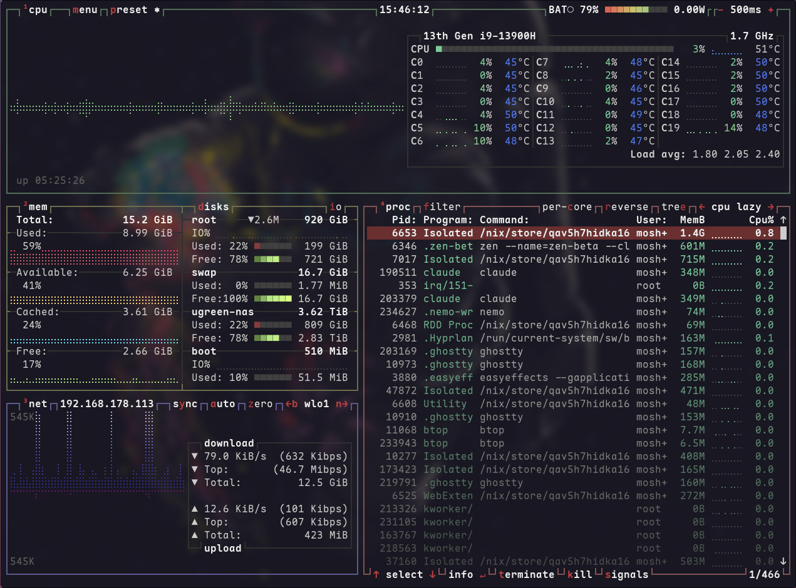
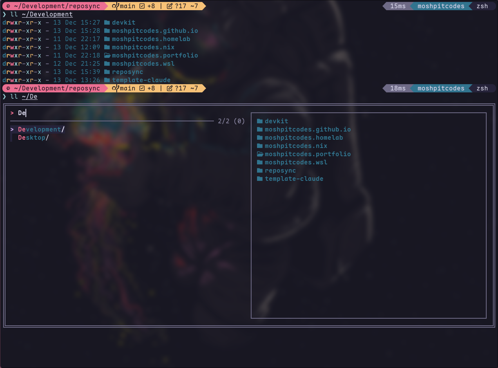

<h1 align="center">
   
   <br>
      My NixOS Configuration
   <br>
       <br>

   <div align="center">
      <p></p>
      <div align="center">
         <a href="https://github.com/MoshPitCodes/moshpitcodes.nix/stargazers">
            
         </a>
         <a href="https://github.com/MoshPitCodes/moshpitcodes.nix/">
            
         </a>
         <a href="https://nixos.org">
            
         </a>
         <a href="https://github.com/MoshPitCodes/moshpitcodes.nix/blob/main/LICENSE">
            
         </a>
      </div>
      <br>
   </div>
   <div>
      <a href="https://github.com/MoshPitCodes/moshpitcodes.nix/actions/workflows/test-flake.yml">
         
      </a>
      <a href="https://github.com/MoshPitCodes/moshpitcodes.nix/actions/workflows/test-configurations.yml">
         
      </a>
   </div>
</h1>
<br/>

# Overview

My personal NixOS system configuration. This is something I have been working on over the past couple of months while learning NixOS and slowly transitioning from Windows to NixOS for all my development work.

**Hardware:**
- ASUS Zenbook 14X OLED (Intel Core i9 13900H, Intel XE Graphics, 16GB DDR-5)
- Desktop (Intel Core i7 13700K, Nvidia RTX 4070Ti Super, 64GB DDR-5)

> [!WARNING]
> This is a heavily opinionated configuration that is likely not a great repository if you're just starting out with Linux or if you're trying to learn what NixOS is all about. The setup is tailored to my specific needs and will likely not provide a great baseline for you to build off of.

<br/>

## Documentation

| Document | Description |
|----------|-------------|
| [Installation](docs/installation.md) | Complete installation guide |
| [Configuration](docs/configuration.md) | Monitors, wallpapers, secrets, aliases |
| [WSL Setup](docs/wsl.md) | Windows Subsystem for Linux |
| [Development Shells](docs/development-shells.md) | Nix dev environments |
| [Scripts](docs/scripts.md) | System management scripts |
| [Secrets](SECRETS.md) | Secret management guide |

<br/>

## Project Structure

-   [./flake.nix](flake.nix) Entry point to the configuration
-   [./hosts/](hosts) Per-host configurations
    - [../desktop/](hosts/desktop/) Desktop configuration
    - [../laptop/](hosts/laptop/) Laptop configuration
    - [../vm/](hosts/vm/) QEMU/KVM configuration
    - [../vmware-guest/](hosts/vmware-guest/) VMWare configuration
    - [../wsl/](hosts/wsl/) WSL2 configuration
-   [./modules/](modules) Modularized NixOS configurations
    -   [../core/](modules/core/) Core NixOS configuration
    -   [../home/](modules/home/) [Home Manager](https://github.com/nix-community/home-manager) user configurations
-   [./overlays/](overlays) Nixpkgs overlays
-   [./shells/](shells) Development shell environments
-   [./scripts/](scripts) Utility scripts
-   [./pkgs/](pkgs) Custom packages
-   [./wallpapers/](wallpapers) Wallpapers collection

>[!TIP]
> If you open this `README.md` file in [VSCode][VSCode] or [VSCodium][VSCodium], you can `Ctrl + LMB` the links above.

<br/>

## Project Components

| Use Case                    | Software                                                                            |
| --------------------------- | :---------------------------------------------------------------------------------- |
| **Display Server Protocol** | [Wayland][Wayland]                                                                  |
| **Window Manager**          | [Hyprland][Hyprland]                                                                |
| **Wallpaper Manager**       | [Waypaper][Waypaper] + [Hyprpaper][Hyprpaper]                                       |
| **Information Bar**         | [Waybar][Waybar]                                                                    |
| **Application Launcher**    | [rofi][rofi]                                                                        |
| **Notification Daemon**     | [swaync][swaync]                                                                    |
| **Terminal Emulator**       | [Ghostty][Ghostty]                                                                  |
| **Shell**                   | [zsh][zsh] + [Oh-My-Posh][Oh-My-Posh]                                               |
| **Text Editor**             | [VSCodium][VSCodium] + [VSCode][VSCode] + [Neovim][Neovim]                          |
| **AI Editor**               | [CursorAI][CursorAI]                                                                |
| **Network Management Tool** | [NetworkManager][NetworkManager] + [network-manager-applet][network-manager-applet] |
| **System Resource Monitor** | [Btop][Btop]                                                                        |
| **File Manager**            | [nemo][nemo] + [yazi][yazi]                                                         |
| **Fonts**                   | [Maple Mono][Maple Mono]                                                            |
| **Color Scheme**            | [Rose Pine][Rose Pine]                                                              |
| **GTK Theme**               | [Colloid GTK Theme][Colloid GTK Theme]                                              |
| **Mouse Cursor Theme**      | [Bibata-Modern-Ice][Bibata-Modern-Ice]                                              |
| **Icon Theme**              | [Papirus-Dark][Papirus-Dark]                                                        |
| **Lockscreen**              | [Hyprlock][Hyprlock] + [Swaylock-effects][Swaylock-effects]                         |
| **Image Viewer**            | [imv][imv]                                                                          |
| **Screenshot Tool**         | [grimblast][grimblast]                                                              |
| **Screen Recording Tool**   | [wf-recorder][wf-recorder] + [OBS][OBS]                                             |
| **Media Player**            | [mpv][mpv]                                                                          |
| **Music Player**            | [audacious][audacious]                                                              |
| **Clipboard Management**    | [wl-clip-persist][wl-clip-persist]                                                  |
| **Color Picker**            | [hyprpicker][hyprpicker]                                                            |
| **Password Manager**        | [1Password][1Password]                                                              |
| **DevOps Tools**            | kubectl, terraform, ansible, helm, k9s, Docker/Podman                               |
| **Network Storage**         | Samba/CIFS support for network shares                                               |

<br/>

## Key Features

### Modular Architecture
- **Flexible Host Configurations**: Separate configurations for desktop, laptop, VM, VMware guest, and WSL2
- **Reusable Modules**: Core system modules and Home Manager user configurations
- **Custom Overlays**: Package version overrides through Nixpkgs overlays

### Development Tools
- **Multiple Dev Shells**: Specialized environments for different workflows (default, devshell, claude-flow)
- **AI Development**: Claude Flow integration for AI-assisted development workflows
- **Full DevOps Stack**: kubectl, terraform, ansible, Docker/Podman, and more

### System Management
- **Interactive Installation**: Step-by-step guided setup with `install.sh`
- **Smart Rebuilds**: Rebuild script with cache clearing, garbage collection, and dry-run options
- **Automated Scripts**: 20+ user scripts for common tasks

### Cross-Platform
- **WSL2 Integration**: Full WSL2 support with systemd, Docker, and Windows interop
- **VM Support**: Optimized configurations for QEMU/KVM and VMware
- **Consistent Experience**: Same tools and workflows across all platforms

<br/>

## Quick Start

```bash
# Clone the repository
nix-shell -p git
git clone https://github.com/MoshPitCodes/moshpitcodes.nix
cd moshpitcodes.nix

# Configure secrets
cp secrets.nix.example secrets.nix
# Edit secrets.nix with your values

# Run the installer
./install.sh
```

See the [Installation Guide](docs/installation.md) for detailed instructions.

<br/>

## Gallery

<p align="center">
    <br>
    <br>
    <br>
   Screenshots last updated <b>2025-12-13</b>
</p>

<br/>

# Credits

Other dotfiles that have inspired me greatly:

- NixOS & Flakes
  - [alt-f4-llc/kickstart.nix](https://github.com/ALT-F4-LLC/kickstart.nix): Forever grateful for BG and the crew!
  - [alt-f4-llc/dotfiles.nix](https://github.com/ALT-F4-LLC/dotfiles.nix): Well, what can I say \o/
  - [mitchellh/nixos-config](https://github.com/mitchellh/nixos-config): The man himself!
  - [frost-phoenix/nixos-config](https://github.com/Frost-Phoenix/nixos-config/tree/catppuccin): General flake / files structure
  - [fufexan/dotfiles](https://github.com/fufexan/dotfiles)
  - [tluijken/.dotfiles](https://github.com/tluijken/.dotfiles): Base rofi config
  - [mrh/dotfiles](https://codeberg.org/mrh/dotfiles): Base Waybar config

- README
  - [ryan4yin/nix-config](https://github.com/ryan4yin/nix-config)
  - [notashelf/nyx](https://github.com/NotAShelf/nyx)
  - [sioodmy/dotfiles](https://github.com/sioodmy/dotfiles)
  - [ruixi-rebirth/flakes](https://github.com/Ruixi-rebirth/flakes)
  - [My Nix Journey](https://tech.aufomm.com/my-nix-journey-use-nix-with-ubuntu/)

- Official Resources
  - [NixOS Homepage](https://nixos.org/)
  - [NixOS Manual](https://nixos.org/manual/nixos/stable/)
  - [NixOS Flakes](https://wiki.nixos.org/wiki/Flakes)
  - [NixOS Download](https://nixos.org/download/#nixos-iso)
  - [nixpkgs](https://github.com/NixOS/nixpkgs)
  - [Home Manager Manual](https://nix-community.github.io/home-manager/)

<br/>

<p align="center"></p>

<br/>

<p align="center"></p>

<div align="right">
  <a href="#readme">Back to the Top</a>
</div>

<!-- Links -->
[Wayland]: https://wayland.freedesktop.org/
[Hyprland]: https://github.com/hyprwm/Hyprland
[Waypaper]:https://github.com/anufrievroman/waypaper
[Hyprpaper]: https://github.com/hyprwm/hyprpaper
[Ghostty]: https://ghostty.org/
[Oh-My-Posh]: https://ohmyposh.dev/
[Waybar]: https://github.com/Alexays/Waybar
[rofi]: https://github.com/lbonn/rofi
[Btop]: https://github.com/aristocratos/btop
[nemo]: https://github.com/linuxmint/nemo/
[yazi]: https://github.com/sxyazi/yazi
[zsh]: https://ohmyz.sh/
[Swaylock-effects]: https://github.com/mortie/swaylock-effects
[Hyprlock]: https://github.com/hyprwm/hyprlock
[audacious]: https://audacious-media-player.org/
[mpv]: https://github.com/mpv-player/mpv
[VSCodium]:https://vscodium.com/
[VSCode]: https://code.visualstudio.com/
[Neovim]: https://github.com/neovim/neovim
[CursorAI]: https://www.cursor.com/
[grimblast]: https://github.com/hyprwm/contrib
[Rose Pine]: https://rosepinetheme.com/
[hyprpicker]: https://github.com/hyprwm/hyprpicker
[imv]: https://sr.ht/~exec64/imv/
[swaync]: https://github.com/ErikReider/SwayNotificationCenter
[Maple Mono]: https://github.com/subframe7536/maple-font
[NetworkManager]: https://wiki.gnome.org/Projects/NetworkManager
[network-manager-applet]: https://gitlab.gnome.org/GNOME/network-manager-applet/
[wl-clip-persist]: https://github.com/Linus789/wl-clip-persist
[wf-recorder]: https://github.com/ammen99/wf-recorder
[Papirus-Dark]: https://github.com/PapirusDevelopmentTeam/papirus-icon-theme
[Bibata-Modern-Ice]: https://www.gnome-look.org/p/1197198
[maxfetch]: https://github.com/jobcmax/maxfetch
[Colloid GTK Theme]: https://github.com/vinceliuice/Colloid-gtk-theme
[OBS]: https://obsproject.com/
[1Password]: https://1password.com/
